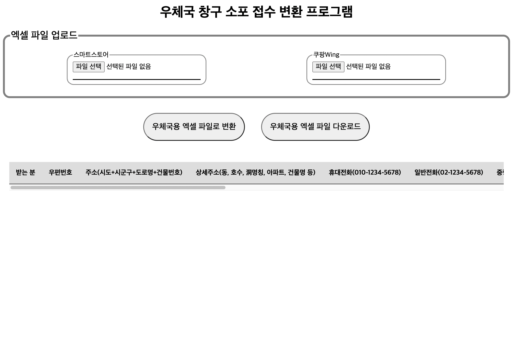

# 우체국 창구소포 접수 자동화 웹 애플리케이션

- 스마트스토어, 쿠팡Wing의 엑셀 파일을 업로드하여 우체국 창구소포 접수 양식으로 변환하는 웹 애플리케이션 입니다.

- 접속 링크 : [https://beeimp.github.io/automation-of-parcel-reception-at-post-office/](https://beeimp.github.io/automation-of-parcel-reception-at-post-office/)

## 기능

### 파일 선택

* 각 사이트의 엑셀 파일 추가
* 추가한 엑셀 파일을 요약한 내용 표시

### 우체국용 엑셀 파일로 변환 버튼

* 엑셀 파일을 우체국의 사전 창구 접수의 양식에 따라 저장
* html table element로 변환하여 표시
* 도로명/지번 주소를 기본 주소와 상세 주소로 분리

### 우체국용 엑셀 파일 다운로드

* 저장한 데이터를 엑셀 파일로 변환
* 엑셀 파일을 로컬에 다운로드
